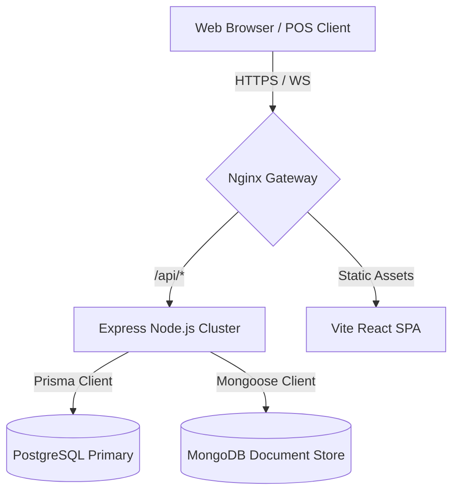
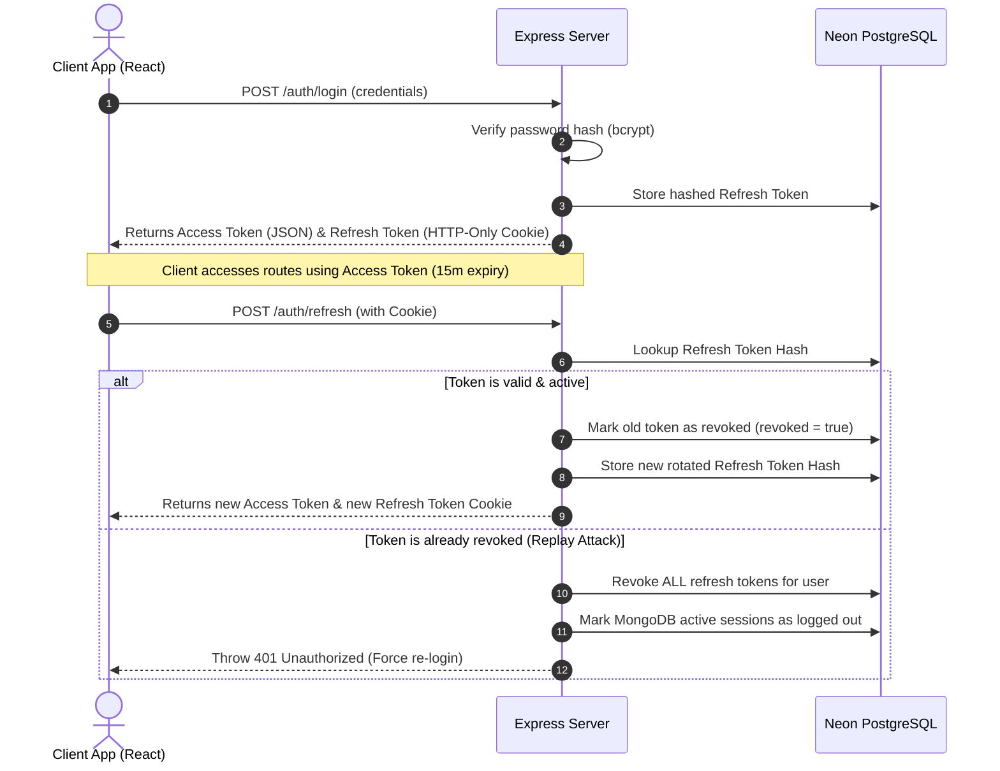

# System Architecture & Technical Blueprint

This document details the architectural decisions and system layout for **Oven Xpress**, an enterprise-ready Restaurant Management System (RMS).

---

## 1. System Topology Overview

Oven Xpress is structured as a modular monorepo using **npm workspaces**, organizing the frontend and backend into decoupled packages sharing consistent tooling configurations.



---

## 2. Core Architectural Design Patterns

### Feature-Based Folder Structures

Both frontend and backend adopt a domain-driven, feature-based organization. This ensures codebase scaling does not degrade searchability or maintainability.

- **Frontend**: Modules are broken into `features/` where elements related to a domain (e.g. `auth/`, `orders/`) contain their specific UI components, slices, and hooks. Shared capabilities live in `shared/`.
- **Backend**: Express code is partitioned into `modules/`, clustering routes, controllers, services, and validators by entity domain (e.g. `auth/`, `menu/`).

### Dual-Database Partitioning (CQRS Lite)

We leverage both relational (SQL) and document (NoSQL) databases to align storage engines with the nature of the data:

| Engine         | Primary Purpose                              | Tech Stack   | Rationale                                                                                                           |
| :------------- | :------------------------------------------- | :----------- | :------------------------------------------------------------------------------------------------------------------ |
| **PostgreSQL** | Relational, ACID Transactions                | Prisma ORM   | Critical for operational financial records, user accounts, tables, and billing where consistency is non-negotiable. |
| **MongoDB**    | Document store, high-volume flexible schemas | Mongoose ODM | Ideal for dynamic catalog trees, ingredients, real-time KDS log queues, and audit logs.                             |

---

## 3. Technology Integration Details

### Frontend Architecture

1. **State Management**: Dual-engine approach:
   - **TanStack (React) Query**: Owns server state caching, mutations, background revalidation, and loading flags.
   - **Redux Toolkit**: Encapsulates client-only global state (e.g. active sidebar layouts, cart draft overlays, local workspace selections).
2. **Styling**: Vanilla Tailwind CSS, integrating modern dark/light system variables.
3. **Animations**: Framer Motion enforces premium UX transitions (collapsible lists, routing transitions, order slide-outs).
4. **Networking**: Standardized Axios instance with automatic response interceptors handling unauthorized token refreshes.

### Backend Architecture

1. **Strict Type-Safety**: 100% compiled via TypeScript. Zod schema validators serve as boundaries, parsing input payloads (`req.body`, `req.query`, `req.params`) in middlewares before controller routes.
2. **Error Pipeline**: Centralized error middleware formats exceptions into standard envelopes, preventing server stack trace leaks to client responses while saving logs to Winston.
3. **Security & Auth Pipelines**:
   - Double-wrapped guards protecting restricted routes using `authGuard` and `restrictTo` middlewares.
   - Core user roles: `CUSTOMER`, `ADMIN`, `KITCHEN_STAFF`, `DELIVERY_PARTNER`, `CASHIER`, and `SUPER_ADMIN`.

---

## 4. Authentication, Authorization & Security Specifications

### A. JWT Authentication & Refresh Token Rotation (RTR)

Oven Xpress implements a strict token rotation strategy to prevent XSS session hijackings and token replay attacks.



1. **Access Token (Short-lived)**: Expiration of 15 minutes, returned in response JSON. Payload: `{ id: userId, email: email, role: role }`.
2. **Refresh Token (Long-lived)**: Expiration of 7 days, stored exclusively in a secure, HTTP-only, SameSite=Lax cookie.
3. **Token Hashing**: Refresh tokens are stored as SHA-256 hashes in PostgreSQL to guarantee database compromise does not leak active tokens.
4. **Replay Protection**: If a client attempts to refresh using a token already marked as revoked, it indicates a compromise. The server immediately invalidates all active tokens and sessions associated with that user.

### B. Role-Based Access Controls (RBAC)

Clear privilege hierarchies are enforced across all services:
- **SUPER_ADMIN**: Absolute system configuration overrides, database migrations, role elevations.
- **ADMIN**: Branch configurations, employee registries, report reviews, refund authorizations.
- **CASHIER**: Floor plan management, order creation, bill settlements.
- **KITCHEN_STAFF**: Kitchen display ticket queue management, status updates.
- **DELIVERY_PARTNER**: Order delivery assignments, fulfillment tracking.
- **CUSTOMER**: Order catalog reviews, basket selections, profile updates.

```typescript
// Enforced at route definition:
router.patch('/profile', authGuard, restrictTo('CUSTOMER', 'ADMIN', 'CASHIER'));
```

### C. Google OAuth Flow

Integrated Google Sign-in allows fast single-sign-on (SSO) credentials:
1. The frontend client triggers Google OAuth consent, returning a verified ID Token (`id_token`).
2. The client posts the token to `/api/v1/auth/google`.
3. The backend uses Google's `google-auth-library` to check signatures and extract `email`, name details, and `picture` url.
4. If the user does not exist, a new account is registered with `isEmailVerified: true` and default role `CUSTOMER`.
5. Tokens are generated and returned to complete the login sequence.

### D. Security Hardening Configurations

- **Helmet**: Enforces secure HTTP headers, including clickjacking and Content Security Policy parameters.
- **IP Rate Limiting**: Throttles brute force requests:
  - Auth Pipeline (login, register): 100 requests per 15 minutes.
  - OTP Dispatch: 10 requests per hour.
- **Sanitization Middleware**: Recursively strips HTML tags from request strings using regex rules to prevent XSS script injections.
- **CORS Configuration**: Explicitly permits credentials exchange (`credentials: true`) with originating ports.
- **CSRF Ready**: Express session tracking relies on HTTP-only cookie parameters, prepared to couple with CSRF tokens on header requests.

### E. MongoDB Security Audits & Session Logs

Highly sensitive account lifecycle actions write logs directly to MongoDB:
- **Audit Logs** (`audit_logs` collection): Documents `userId`, `action` (`LOGIN`, `LOGOUT`, `PASSWORD_RESET`, `EMAIL_VERIFICATION`, `ROLE_CHANGE`), client IP, browser, device category, and payload context.
- **Active Sessions** (`user_sessions` collection): Monitors concurrent device registrations. Tracks device category, browser details, login time, and maps them to refresh token hashes. Allows users to "terminate all other devices" securely.

---

## 5. Customer Application Foundation (PR-004)

### A. Customer App Architecture
The customer experience is organized as a decoupled, responsive user interface structure plugged directly into the shared state and route modules of the monorepo:
1. **Public/Guest Navigation**: Sticky headers, dynamic color transforms on scroll, and a Framer Motion-based mobile navigation drawer.
2. **Account Section Structure**: A unified sidebar navigation (`ProfileLayout`) rendering favorites, order histories, and account details.
3. **State Management Integration**: Uses the `customerSlice` Redux reducer to cache user outpost branch selections, search queries, and dietary preferences to browser `localStorage`.

### B. Routing Structure
Routes are configured in [AppRoutes.tsx](file:///C:/Users/shubh/OneDrive/Desktop/Projects/Resturant_Managment_System/frontend/src/routes/AppRoutes.tsx) under the following layout hierarchy:
* **CustomerLayout / GuestLayout**:
  * `/` (LandingPage - Hero, category bar, testimonials, newsletter)
  * `/about` (AboutPage - History, operational pillars)
  * `/contact` (ContactPage - Support ticket logging form)
  * `/branches` (BranchesPage - Outpost listing, location calculation, setting active branch)
  * `/search` (SearchPage - Debounced input filtering, popular tag chips, matching lists)
  * `/offers` (OffersPage - Discount code copy cards)
  * `/menu` (MenuPlaceholderPage - Future modular plug-in)
  * `/cart` (CartPlaceholderPage - Future modular plug-in)
  * `/checkout` (CheckoutPlaceholderPage - Future modular plug-in)
  * `/product/:id` (ProductPlaceholderPage - Future modular plug-in)
* **ProtectedRoute / ProfileLayout** (inside CustomerLayout):
  * `/profile` (ProfilePage - Account settings)
  * `/favorites` (FavoritesPage - Wishlist empty states)
  * `/orders` (OrdersPage - Smart status timeline stream, past invoice lists)
* **ErrorLayout**:
  * `/offline` (OfflinePage - Browser connection listener page)
  * `/server-error` (ServerErrorPage - 500 fallback screen)
  * `/not-found` (NotFoundPage - 404 screen)
* **Staff Dashboard** (`/staff`, `/staff/tables`, `/staff/design-system` under `MainLayout`)

### C. SEO Strategy
SEO metadata is handled by a reusable `<SEO>` component backed by `react-helmet-async`. It dynamically injects:
1. Title tags (`title` | Oven Xpress)
2. Meta Descriptions & Meta Keywords
3. Open Graph (OG) tags for Facebook/LinkedIn previews
4. Twitter Cards
5. JSON-LD Structured Data Schema injections (e.g. for restaurant locations or ratings).

### D. Performance Strategy
1. **Route Lazy Loading**: Pages are code-split using `React.lazy` and loaded dynamically.
2. **Suspense Boundaries**: Router mounts wrapped in `<Suspense>` using specialized layout skeletons or spinner indicators to reduce First Contentful Paint (FCP) lag.
3. **Debounced Network Simulators**: Global searches utilize a 400ms debounce buffer to limit excessive re-rendering.
4. **Image Optimizations**: Image components leverage lazy-loading (`loading="lazy"`) and optimized compression via unsplash parameters.
