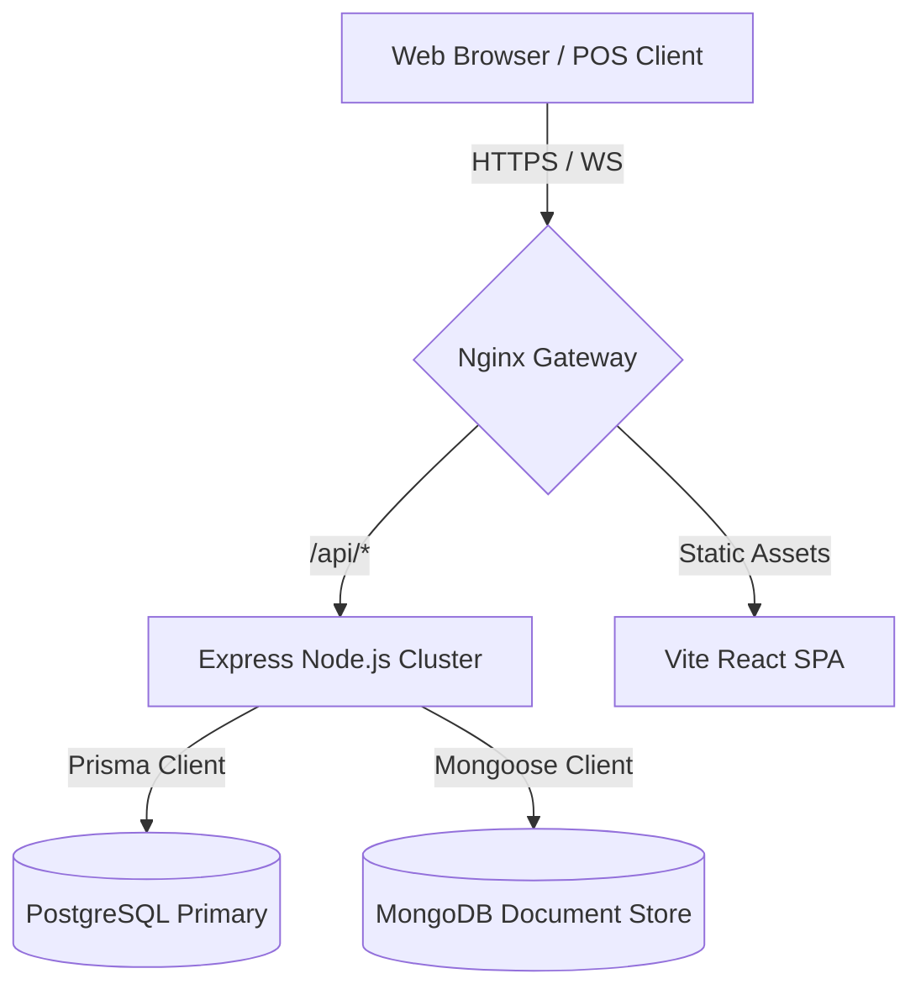

# System Architecture & Technical Blueprint

This document details the architectural decisions and system layout for **Oven Xpress**, an enterprise-ready Restaurant Management System (RMS).

---

## 1. System Topology Overview

Oven Xpress is structured as a modular monorepo using **npm workspaces**, organizing the frontend and backend into decoupled packages sharing consistent tooling configurations.

---

## 2. Core Architectural Design Patterns

### Feature-Based Folder Structures

Both frontend and backend adopt a domain-driven, feature-based organization. This ensures codebase scaling does not degrade searchability or maintainability.

- **Frontend**: Modules are broken into `features/` where elements related to a domain (e.g. `auth/`, `orders/`) contain their specific UI components, slices, and hooks. Shared capabilities live in `shared/`.
- **Backend**: Express code is partitioned into `modules/`, clustering routes, controllers, services, and validators by entity domain (e.g. `auth/`, `menu/`).

### Dual-Database Partitioning (CQRS Lite)

We leverage both relational (SQL) and document (NoSQL) databases to align storage engines with the nature of the data:

| Engine         | Primary Purpose                              | Tech Stack   | Rationale                                                                                                           |
| :------------- | :------------------------------------------- | :----------- | :------------------------------------------------------------------------------------------------------------------ |
| **PostgreSQL** | Relational, ACID Transactions                | Prisma ORM   | Critical for operational financial records, user accounts, tables, and billing where consistency is non-negotiable. |
| **MongoDB**    | Document store, high-volume flexible schemas | Mongoose ODM | Ideal for dynamic catalog trees, ingredients, real-time KDS log queues, and audit logs.                             |

---

## 3. Technology Integration Details

### Frontend Architecture

1. **State Management**: Dual-engine approach:
   - **TanStack (React) Query**: Owns server state caching, mutations, background revalidation, and loading flags.
   - **Redux Toolkit**: Encapsulates client-only global state (e.g. active sidebar layouts, cart draft overlays, local workspace selections).
2. **Styling**: Vanilla Tailwind CSS, integrating modern dark/light system variables.
3. **Animations**: Framer Motion enforces premium UX transitions (collapsible lists, routing transitions, order slide-outs).
4. **Networking**: Standardized Axios instance with automatic response interceptors handling unauthorized token refreshes.

### Backend Architecture

1. **Strict Type-Safety**: 100% compiled via TypeScript. Zod schema validators serve as barriers, checking ingress payloads (`req.body`, `req.query`, `req.params`) before controllers run.
2. **Error Pipeline**: Centralized middleware parsing errors into typed JSON payloads, preventing raw trace leaks in production while logging stack traces to Winston.
3. **Security Pipeline**:
   - JWT tokens containing user metadata and roles.
   - Double-wrapped authentication and authorization middlewares protecting specific routes with role validations (`ADMIN`, `MANAGER`, `SERVER`, `KITCHEN`).
